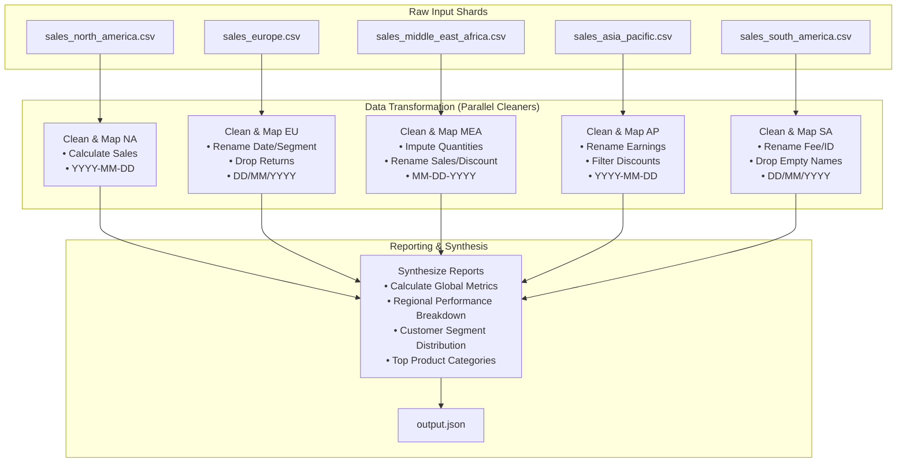

# 📊 E-Commerce Regional Sales Data Cleaning & Aggregation Pipeline

[](https://www.python.org/)
[](https://pandas.pydata.org/)

An enterprise-grade data cleaning, schema reconciliation, and synthesis pipeline designed to process heterogeneous, messy regional sales data. The project simulates an ETL (Extract, Transform, Load) workflow that ingests sales CSV datasets from five global divisions (North America, Europe, Middle East & Africa, Asia Pacific, and South America), cleans them according to strict regional rules, standardizes their schemas, and compiles a comprehensive unified JSON report.

This project is structured as a benchmark task for evaluating single-agent versus multi-agent system performance (using the **Fan-Out-Synthesize** coordination pattern).

---

## 🏗️ Architecture & Workflow

The pipeline decomposes the data integration process into parallel cleaning steps followed by a centralized synthesis step. 




---

## 📋 Standardized Data Schema

Each regional division uploads files with different column names and date formats. The pipeline maps and standardizes them into the following target schema:

| Target Column | Type | Format / Constraints |
| :--- | :--- | :--- |
| **`Order_ID`** | String | Unique Identifier |
| **`Order_Date`** | String | Standardized to `YYYY-MM-DD` |
| **`Customer_Name`** | String | Cannot be empty/null |
| **`Customer_Segment`** | String | `Consumer`, `Corporate`, or `Home Office` |
| **`Country`** | String | Country of purchase |
| **`Region`** | String | Regional division |
| **`Product_Category`**| String | Product department (e.g., Furniture, Technology) |
| **`Product_Name`** | String | Name of the product |
| **`Quantity`** | Integer | Greater than 0 (Returns filtered out) |
| **`Unit_Price`** | Float | Price per unit |
| **`Discount_Percent`**| Integer | Discount percentage (0 to 100, e.g., 15 for 15%) |
| **`Total_Sales`** | Float | Rounded to 2 decimal places |
| **`Shipping_Cost`** | Float | Delivery fee |
| **`Profit`** | Float | Earnings/Profit |
| **`Payment_Method`** | String | Method of payment |

### Regional Schema Mappings

The raw files are mapped to the target schema as follows:

*   **North America (`sales_north_america.csv`)**: Already matches the standard schema.
*   **Europe (`sales_europe.csv`)**:
    *   `Date` ➡️ `Order_Date`
    *   `Segment` ➡️ `Customer_Segment`
*   **Middle East & Africa (`sales_middle_east_africa.csv`)**:
    *   `Sales_Amount` ➡️ `Total_Sales`
    *   `Discount` ➡️ `Discount_Percent`
*   **Asia Pacific (`sales_asia_pacific.csv`)**:
    *   `Earnings` ➡️ `Profit`
*   **South America (`sales_south_america.csv`)**:
    *   `Delivery_Fee` ➡️ `Shipping_Cost`
    *   `Transaction_ID` ➡️ `Order_ID`

---

## 🧹 Data Cleaning & Imputation Rules

To ensure 100% data integrity, the pipeline processes each file using the following sequence:

1.  **Deduplication**: Drop all exact duplicate rows within each shard.
2.  **Remove Missing Customer Names**: Discard any records where `Customer_Name` is empty or null.
3.  **Filter Out Returns**: Discard any records where `Quantity` $\le 0$.
4.  **Filter Out Invalid Discounts**: Discard any records where `Discount_Percent` $< 0$ or $> 100$.
5.  **Handle Missing Quantities & Re-Calculate Sales**:
    *   If `Quantity` is missing or null, impute it with `1`.
    *   If `Quantity` was missing, OR if `Total_Sales` is missing or null, recalculate `Total_Sales` as:
        $$\text{Total Sales} = \text{Quantity} \times \text{Unit Price} \times \left(1 - \frac{\text{Discount Percent}}{100}\right)$$
        *Value is rounded to 2 decimal places.*
6.  **Date Format Standardization**:
    *   Convert `DD/MM/YYYY` (Europe, South America) and `MM-DD-YYYY` (Middle East & Africa) to standard `YYYY-MM-DD` (North America, Asia Pacific).

---

## 📁 Repository Structure

```directory
ecommerce_sales_analysis/
├── README.md               # Project documentation (this file)
├── instruction.md          # Core business logic and requirements
├── decomposition.yaml      # Multi-agent task decomposition flow
├── task.toml               # Benchmark & environment configurations
├── gap_strategy.md         # Rationale for multi-agent execution gap
├── environment/
│   ├── Dockerfile          # Reproducible execution environment
│   └── input_artifacts/    # Messy source regional CSV datasets
├── solution/
│   ├── solve.py            # Standard Python ETL pipeline script
│   └── solve.sh            # Bash runner script
└── tests/
    ├── expected_output.json# Expected outputs for verification
    ├── verify.py           # Automated evaluation script
    └── test.sh             # Tests execution script
```

---

## 🚀 Getting Started

### Prerequisites

Ensure you have Python 3.8+ and `pandas` installed:

```bash
pip install pandas numpy
```

### Running the Pipeline

To execute the data cleaning and aggregation script, run:

```bash
python solution/solve.py
```

This script will:
1. Load the five regional CSVs from the input folder.
2. Apply the individual parsing, renaming, cleaning, and imputation rules.
3. Consolidate the datasets and compute global and regional analytics.
4. Output the final report to `logs/agent/output.json`.

### Verifying the Output

To check the correctness of the generated outputs against the expected results, run:

```bash
python tests/verify.py
```

---

## 📈 Sample Output Summary (`output.json`)

The final report contains metadata, global performance aggregates, and a granular regional breakdown:

```json
{
  "metadata": {
    "total_records_processed": 1991,
    "total_records_dropped": 24
  },
  "global_summary": {
    "total_sales": 482975.86,
    "total_profit": 158387.75,
    "total_quantity": 7078,
    "average_discount_percent": 8.58
  },
  "regional_breakdown": {
    "North America": {
      "total_sales": 133876.39,
      "total_profit": 45250.09,
      "total_quantity": 1996,
      "average_discount_percent": 8.37,
      "top_category": "Furniture",
      "customer_segment_distribution": {
        "Consumer": 280,
        "Corporate": 182,
        "Home Office": 116
      }
    }
  }
}
```

---

## 🤖 Benchmarking Note: Single vs. Multi-Agent Systems

This project highlights a key challenge in LLM-based data pipelines: **long-context schema confusion**.
*   **Single-Agent Systems** often struggle with this task because running a single generic script over multiple files tends to miss edge-case regional anomalies (e.g. failing to impute MEA, or failing to filter AP discounts), resulting in incorrect global aggregates.
*   **Multi-Agent Systems** (via `decomposition.yaml`) utilize a **Fan-Out-Synthesize** pattern. Five localized sub-agents focus purely on cleaning a single regional file, allowing a final Synthesizer agent to merge the clean datasets. This achieves a perfect verification score.
